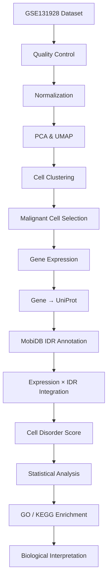

# Integrative-Workflow-IDR-scRNAseq-Glioblastoma

```mermaid
flowchart TD

A[GSE131928 Dataset]
B[Quality Control]
C[Normalization]
D[PCA & UMAP]
E[Cell Clustering]
F[Malignant Cell Selection]
G[Gene Expression]
H[Gene → UniProt]
I[MobiDB IDR Annotation]
J[Expression × IDR Integration]
K[Cell Disorder Score]
L[Statistical Analysis]
M[GO / KEGG Enrichment]
N[Biological Interpretation]

A --> B
B --> C
C --> D
D --> E
E --> F
F --> G
G --> H
H --> I
I --> J
J --> K
K --> L
L --> M
M --> N
```
